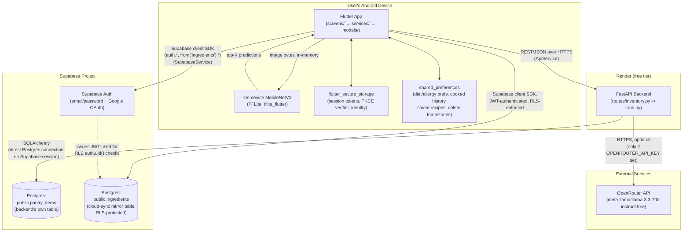
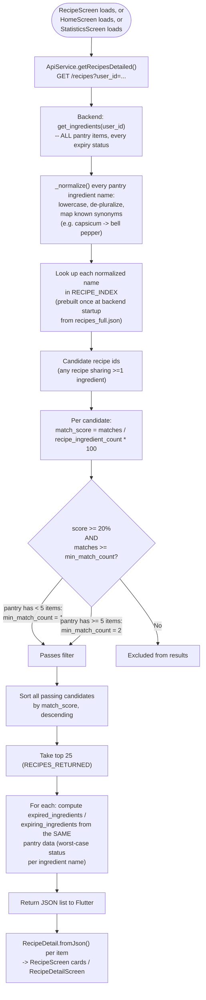
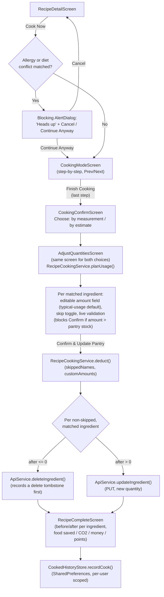
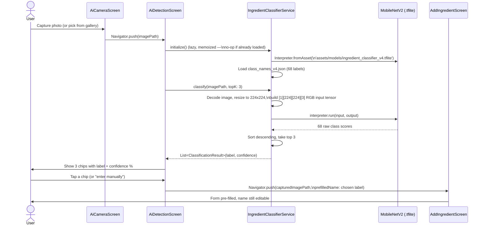

# Fridge2Table — System Architecture

For the design-system tokens (colors, typography) see `docs/UI.md`. For a plain-English narrative of the same flows described here, see `docs/PROJECT_FLOW.md` (an earlier, shorter doc — this one goes deeper and includes diagrams).

---

## 1. High-Level System Diagram



**The one thing to understand above everything else in this diagram:** the app talks to Supabase in **two completely separate, unrelated ways**. The FastAPI backend has its own direct Postgres connection (via SQLAlchemy, using a connection string — no Supabase-issued session, so Row-Level Security's `auth.uid()` is always `NULL` on that connection) and owns its own table, `pantry_items`. The Flutter app *also* talks to Supabase directly, but through the Supabase client SDK with a real signed-in user's JWT, reading/writing a **different** table, `public.ingredients`, which has Row-Level Security enabled. These two tables used to share one name (`ingredients`), which caused a real production bug (see `docs/DATABASE_SCHEMA.md`) — they are deliberately kept as two separate tables now.

## 2. Data Flow: User Authentication

Covers both email/password and Google OAuth, and the two different completion paths (synchronous vs. deep-link callback).

```mermaid
sequenceDiagram
    actor User
    participant SignIn as SignInScreen /\nCreateAccountScreen
    participant Supabase as Supabase Auth
    participant RootListener as main.dart\nonAuthStateChange listener
    participant Main as MainScreen

    alt Email/password
        User->>SignIn: Enter email + password, submit
        SignIn->>SignIn: suppressRootAuthListener = true
        SignIn->>Supabase: signInWithPassword() / signUp()
        Supabase-->>SignIn: session (awaited directly)
        SignIn->>SignIn: AuthService.cacheIdentity()
        SignIn->>Supabase: SupabaseService.resolveConflicts()
        SignIn->>Main: Navigator.pushReplacement
        SignIn->>SignIn: suppressRootAuthListener = false
    else Google OAuth
        User->>SignIn: Tap "Continue with Google"
        SignIn->>Supabase: signInWithOAuth(Google, inAppWebView)
        Note over SignIn,Supabase: Browser/WebView handles the\nGoogle account picker;\nthis call returns immediately\nafter *launching* it, not after completion
        Supabase-->>RootListener: onAuthStateChange fires\nlater (async), event=signedIn
        RootListener->>RootListener: Check suppressRootAuthListener\n(false for OAuth) and provider != "email"
        RootListener->>User: Show "New account" / "Welcome back"\nconfirmation dialog
        alt User confirms
            RootListener->>RootListener: AuthService.cacheIdentity()
            RootListener->>Supabase: SupabaseService.resolveConflicts()
            RootListener->>Main: pushAndRemoveUntil (clears back stack)
        else User cancels
            RootListener->>Supabase: signOut()
        end
    else Email confirmation link
        User->>Supabase: Opens confirmation link from inbox
        Supabase-->>RootListener: onAuthStateChange fires,\nsession exists but provider="email"
        RootListener->>Supabase: signOut() (never auto-logs in)
        RootListener->>SignIn: Navigate to SignInScreen\n(emailJustVerified: true)
        SignIn->>User: "Email verified — please sign in" dialog
    end
```

Key file: `frontend/fridge2table_app/lib/main.dart` (`_Fridge2TableAppState._handleSignedIn`). The root listener exists specifically because OAuth and email-link completions happen *after* the screen that triggered them may already be gone — there's no `await`-able call to hang a `Navigator.push` off of. Password sign-in avoids racing the root listener by setting `SupabaseService.suppressRootAuthListener = true` for the duration of its own awaited call.

## 3. Data Flow: Add Ingredient (Manual + AI Scan)


Note: this flow only ever writes to the FastAPI backend (`pantry_items`). The cloud-sync mirror (`public.ingredients`) is *not* touched by an individual add — it only gets the new ingredient on the next sync (`resolveConflicts()`/`syncToCloud()`), which pushes the full local inventory.

## 4. Data Flow: Recipe Matching



Key files: `backend/app/routes/inventory.py` (`_normalize`, `_matched_recipes`, `_expiry_map`, `get_recipes`), `frontend/fridge2table_app/lib/models/recipe_detail.dart`.

## 5. Data Flow: Cooking Flow



Key files: `frontend/fridge2table_app/lib/screens/recipe_detail_screen.dart`, `cooking_mode_screen.dart`, `cooking_confirm_screen.dart`, `adjust_quantities_screen.dart`, `recipe_complete_screen.dart`; `services/recipe_cooking_service.dart`; `models/cooked_history_entry.dart`.

## 6. Data Flow: Cloud Sync (with Conflict Resolution & Tombstone Handling)

`resolveConflicts()` is the two-way sync used both automatically (on every app launch, `MainScreen.initState()`, best-effort/silent) and manually (Cloud Sync screen's "Sync Now" button).


**Why the tombstone step exists:** `ApiService.deleteIngredient()` deletes from the local backend, then best-effort mirrors the delete to Supabase's `ingredients` table. If that mirror call fails (e.g. offline at that exact moment), the cloud row survives. Without a tombstone, the *next* sync would see "local doesn't have this id, cloud does" and conclude it's a new item to pull down — silently undoing the user's delete. The tombstone (`DeleteTombstones`, a small per-user `SharedPreferences`-backed set of ids) lets sync tell "genuinely new cloud item" apart from "deleted locally, mirror never finished" and complete the deferred delete instead.

Key files: `frontend/fridge2table_app/lib/services/supabase_service.dart`, `delete_tombstones.dart`, `api_service.dart`.

## 7. Data Flow: AI Ingredient Detection (Camera → TFLite → Prediction → Prefill)



No network call happens anywhere in this flow — classification is 100% on-device, matching the privacy claim in `docs/PROJECT_OVERVIEW.md` / `Privacy Policy`.

Key files: `frontend/fridge2table_app/lib/services/ingredient_classifier_service.dart`, `screens/ai_camera_screen.dart`, `screens/ai_detection_screen.dart`.

---

## 8. Service-by-Service Reference

All services live in `frontend/fridge2table_app/lib/services/`. None of them hold Flutter widget state — they're plain static-method classes called from screens.

### `ApiService` (`api_service.dart`)
The **only** place that talks to the FastAPI backend. Every screen goes through this, never `http` directly.
- `_userId` (private getter) — throws if nobody is signed in; every request is scoped by this.
- `_send()` (private) — wraps every HTTP call with a 10-second timeout and translates `TimeoutException`/`SocketException` into specific, actionable error messages (including detecting the "forgot `adb reverse`" case on physical dev devices).
- `getInventory()`, `addIngredient()`, `updateIngredient()`, `deleteIngredient()` — CRUD against `/inventory`, `/ingredient`. `deleteIngredient()` additionally manages the delete-tombstone lifecycle and mirrors the delete to `SupabaseService`.
- `getRecipes()` (returns names only, legacy/simple form), `getRecipesDetailed()` (full recipe objects), `getAiRecommendation()`, `getExpiryStatus()`.

### `SupabaseService` (`supabase_service.dart`)
The **only** place that talks to Supabase's cloud-sync table (`public.ingredients`) or Supabase Auth session state directly.
- `initialize()` — called once in `main()`, sets up secure-storage-backed session/PKCE persistence.
- `suppressRootAuthListener` — a flag password sign-in sets so it doesn't race `main.dart`'s root auth listener.
- `deleteIngredient()`, `syncToCloud()`, `syncFromCloud()`, `resolveConflicts()` — see §6 above.

### `AuthService` (`auth_service.dart`)
Local cache of identity + non-sensitive preferences. **Not** the source of truth for credentials (Supabase Auth is) — this only mirrors display data.
- `cacheIdentity()`, `getName()`, `getEmail()`, `getCreatedAt()`, `clearSession()` — secure-storage-backed.
- `saveDietPreferences()`, `getDietPreferences()`, `saveAllergies()`, `getAllergies()` — `SharedPreferences`-backed, keyed via `UserScope`.

### `UserScope` (`user_scope.dart`)
Namespaces `SharedPreferences` keys by the signed-in Supabase user's id (or a random per-install fallback id if signed out), so switching accounts on one device can't leak one user's local data into another's. Used by `AuthService`, `CookedHistoryStore`, `SavedRecipesStore`, `DeleteTombstones`.

### `DeleteTombstones` (`delete_tombstones.dart`)
Persisted per-user set of ingredient ids deleted locally whose cloud mirror-delete hasn't been confirmed yet. See §6.

### `IngredientClassifierService` (`ingredient_classifier_service.dart`)
Loads the bundled TFLite model + class-names JSON once (memoized), runs inference. See §7.

### `RecipeCookingService` (`recipe_cooking_service.dart`)
Pure logic, no state: `planUsage()` (pre-deduction preview) and `deduct()` (actually subtracts from the pantry, deletes if a quantity hits zero). Contains the unit-aware `_typicalUsage()` defaults (e.g. 100g, 2pcs, 0.5 cups) since real recipes only list ingredient names, not quantities.

### `NotificationService` (`notification_service.dart`)
Implemented (`initialize()`, `checkAndNotify()`) but **never called anywhere in the app** — see `docs/PROJECT_OVERVIEW.md` §6. Would, if wired up, fire one OS notification per expired/today/soon ingredient, using the ingredient's own database id as the notification id so repeat calls replace rather than duplicate.

### `SecureSupabaseLocalStorage` / `SecureSupabasePkceStorage` (`secure_storage_service.dart`)
Adapter classes handed to `Supabase.initialize()` so the session and PKCE verifier persist in `flutter_secure_storage` instead of the package's plain-`SharedPreferences` default.

### `CookedHistoryStore` (`models/cooked_history_entry.dart` — a store class alongside the model, not a separate service file)
Per-user, `SharedPreferences`-backed history of cooked recipes. In-memory cache + `reset()` (called on logout) on top of the persisted list. Also derives `ecoScore`, `badgeCount`, category breakdowns, etc.

### `SavedRecipesStore` (`saved_recipes_store.dart`)
Same pattern as `CookedHistoryStore`, for bookmarked recipe names.
