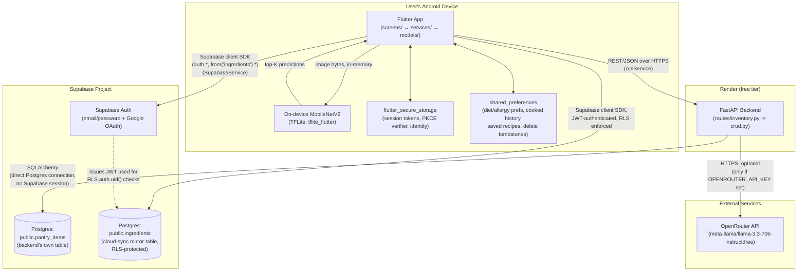
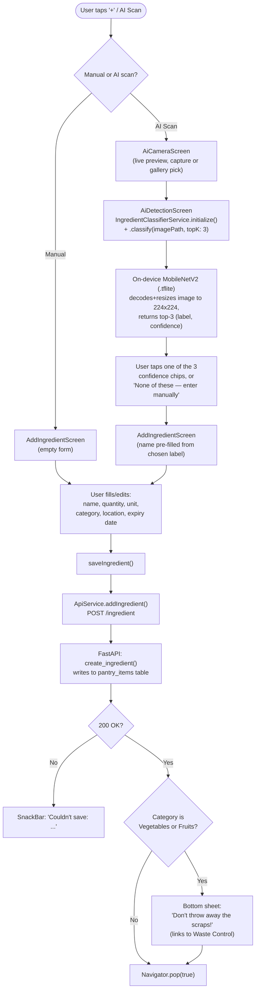
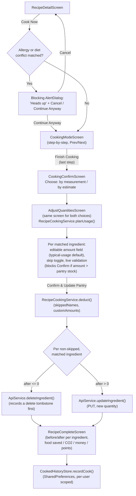
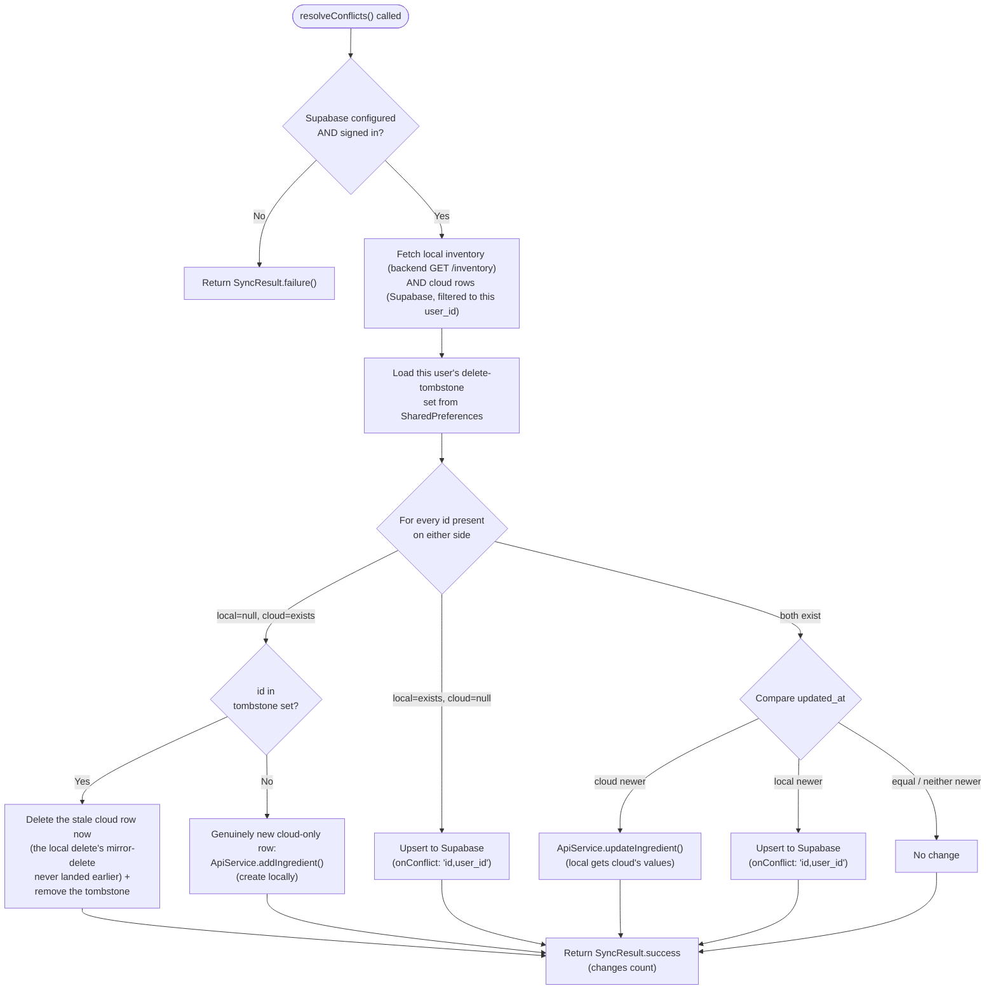
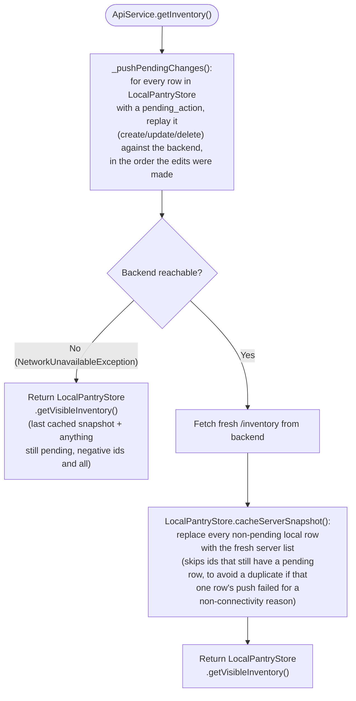
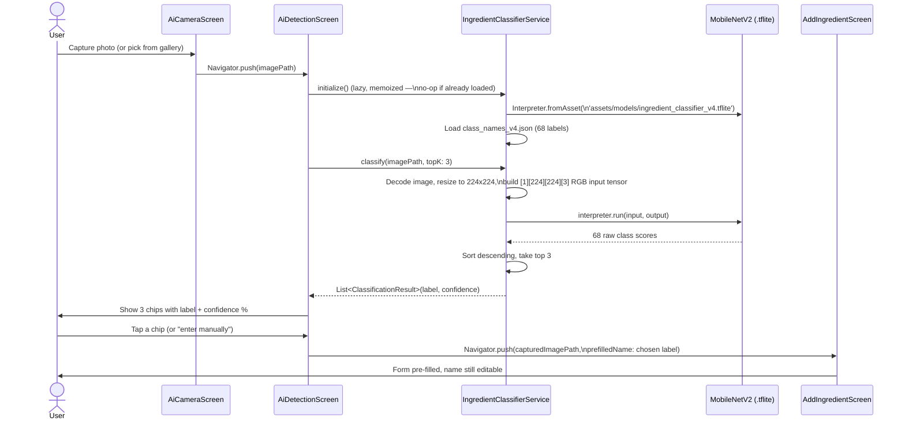

# Fridge2Table — System Architecture

For the design-system tokens (colors, typography) see `docs/UI.md`. For a plain-English narrative of the same flows described here, see `docs/PROJECT_FLOW.md` (an earlier, shorter doc — this one goes deeper and includes diagrams).

---

## 1. High-Level System Diagram



**The one thing to understand above everything else in this diagram:** the app talks to Supabase in **two completely separate, unrelated ways**. The FastAPI backend has its own direct Postgres connection (via SQLAlchemy, using a connection string — no Supabase-issued session, so Row-Level Security's `auth.uid()` is always `NULL` on that connection) and owns its own table, `pantry_items`. The Flutter app *also* talks to Supabase directly, but through the Supabase client SDK with a real signed-in user's JWT, reading/writing a **different** table, `public.ingredients`, which has Row-Level Security enabled. These two tables used to share one name (`ingredients`), which caused a real production bug (see `docs/DATABASE_SCHEMA.md`) — they are deliberately kept as two separate tables now.

## 2. Data Flow: User Authentication

Covers both email/password and Google OAuth, and the two different completion paths (synchronous vs. deep-link callback).

```mermaid
sequenceDiagram
    actor User
    participant SignIn as SignInScreen /\nCreateAccountScreen
    participant Supabase as Supabase Auth
    participant RootListener as main.dart\nonAuthStateChange listener
    participant Main as MainScreen

    alt Email/password
        User->>SignIn: Enter email + password, submit
        SignIn->>SignIn: suppressRootAuthListener = true
        SignIn->>Supabase: signInWithPassword() / signUp()
        Supabase-->>SignIn: session (awaited directly)
        SignIn->>SignIn: AuthService.cacheIdentity()
        SignIn->>Supabase: SupabaseService.resolveConflicts()
        SignIn->>Main: Navigator.pushReplacement
        SignIn->>SignIn: suppressRootAuthListener = false
    else Google OAuth
        User->>SignIn: Tap "Continue with Google"
        SignIn->>Supabase: signInWithOAuth(Google, inAppWebView)
        Note over SignIn,Supabase: Browser/WebView handles the\nGoogle account picker;\nthis call returns immediately\nafter *launching* it, not after completion
        Supabase-->>RootListener: onAuthStateChange fires\nlater (async), event=signedIn
        RootListener->>RootListener: Check suppressRootAuthListener\n(false for OAuth) and provider != "email"
        RootListener->>User: Show "New account" / "Welcome back"\nconfirmation dialog
        alt User confirms
            RootListener->>RootListener: AuthService.cacheIdentity()
            RootListener->>Supabase: SupabaseService.resolveConflicts()
            RootListener->>Main: pushAndRemoveUntil (clears back stack)
        else User cancels
            RootListener->>Supabase: signOut()
        end
    else Email confirmation link
        User->>Supabase: Opens confirmation link from inbox
        Supabase-->>RootListener: onAuthStateChange fires,\nsession exists but provider="email"
        RootListener->>Supabase: signOut() (never auto-logs in)
        RootListener->>SignIn: Navigate to SignInScreen\n(emailJustVerified: true)
        SignIn->>User: "Email verified — please sign in" dialog
    end
```

Key file: `frontend/fridge2table_app/lib/main.dart` (`_Fridge2TableAppState._handleSignedIn`). The root listener exists specifically because OAuth and email-link completions happen *after* the screen that triggered them may already be gone — there's no `await`-able call to hang a `Navigator.push` off of. Password sign-in avoids racing the root listener by setting `SupabaseService.suppressRootAuthListener = true` for the duration of its own awaited call.

## 3. Data Flow: Add Ingredient (Manual + AI Scan)



Note: this flow only ever writes to the FastAPI backend (`pantry_items`). The cloud-sync mirror (`public.ingredients`) is *not* touched by an individual add — it only gets the new ingredient on the next sync (`resolveConflicts()`/`syncToCloud()`), which pushes the full local inventory.

## 4. Data Flow: Recipe Matching


Key files: `backend/app/routes/inventory.py` (`_normalize`, `_matched_recipes`, `_expiry_map`, `get_recipes`), `frontend/fridge2table_app/lib/models/recipe_detail.dart`.

## 5. Data Flow: Cooking Flow



Key files: `frontend/fridge2table_app/lib/screens/recipe_detail_screen.dart`, `cooking_mode_screen.dart`, `cooking_confirm_screen.dart`, `adjust_quantities_screen.dart`, `recipe_complete_screen.dart`; `services/recipe_cooking_service.dart`; `models/cooked_history_entry.dart`.

## 6. Data Flow: Cloud Sync (with Conflict Resolution & Tombstone Handling)

`resolveConflicts()` is the two-way sync used both automatically (`SupabaseService.autoBackupIfAllowed()`, called from `MainScreen.initState()` and a 15-minute background timer while "Background Backup" is on — gated on the "Auto Backup on WiFi"/"Auto Backup on Mobile Data" toggles, best-effort/silent) and manually (Cloud Sync screen's "Back Up Now" button — always runs regardless of those toggles, since a deliberate tap should). `syncFromCloud()` (pull-only) backs the same screen's "Restore" button.



**Why the tombstone step exists:** `ApiService.deleteIngredient()` deletes from the local backend, then best-effort mirrors the delete to Supabase's `ingredients` table. If that mirror call fails (e.g. offline at that exact moment), the cloud row survives. Without a tombstone, the *next* sync would see "local doesn't have this id, cloud does" and conclude it's a new item to pull down — silently undoing the user's delete. The tombstone (`DeleteTombstones`, a small per-user `SharedPreferences`-backed set of ids) lets sync tell "genuinely new cloud item" apart from "deleted locally, mirror never finished" and complete the deferred delete instead.

Key files: `frontend/fridge2table_app/lib/services/supabase_service.dart`, `delete_tombstones.dart`, `api_service.dart`.

**Interaction with offline mode (§7):** `resolveConflicts()`/`syncFromCloud()` call `ApiService.addIngredient(cloudItem)` for every cloud-only row, and rely on that call preserving `cloudItem.id` so the resulting local row lands on the backend with the *same* id — that's what makes a repeated sync idempotent (the backend's `create_ingredient` upserts by id instead of inserting a fresh row every time). `ApiService._createIngredientOnServer()` therefore only strips an id when it's `null` or the offline-queue's negative local-only sentinel (see §7) — never a genuine positive id. Stripping *all* ids unconditionally was a real bug shipped briefly during offline-mode development: every cloud-only row got a new id on every sync, so it could never be recognized as "already pulled in" and kept getting re-created, duplicating the pantry on every Backup/Restore tap. Confirmed fixed with real before/after row counts logged from `syncToCloud`/`syncFromCloud`/`resolveConflicts` (all three now log local/cloud id sets before and after every run).

## 7. Data Flow: Offline Mode & Local Cache

Everything in this section lives behind `ApiService`'s existing public methods (`getInventory`, `addIngredient`, `updateIngredient`, `deleteIngredient`) — no screen had to change to gain offline support, since the offline-awareness is entirely internal to `ApiService`.



- **Local mirror:** `LocalPantryStore` (sqflite, table `pantry_items`, one file per device — not to be confused with the *backend's* table of the same name) mirrors the backend's pantry, scoped per user via `UserScope.uid`. Each row carries `server_id` (null until synced) and `pending_action` (`null` / `create` / `update` / `delete`) — a row holds only its *current net* pending state, not an operation log, which is what makes two rapid offline edits to the same ingredient collapse into "last edit wins" for free.
- **Ids:** the app-facing `Ingredient.id` is `server_id` when known, or `-local_id` (negative) when a create is still only local. Screens never need to know which — `id < 0` is the only check `ApiService` itself uses to decide whether a `update`/`delete` call even has anything to push to the network.
- **Add/update/delete (`addIngredient`/`updateIngredient`/`deleteIngredient`):** always write to `LocalPantryStore` first (instant, works offline), then attempt the matching network call immediately. On `NetworkUnavailableException` the local write already succeeded, so the call returns normally — the row stays queued for the next sync pass rather than surfacing an error.
- **Reconnect sync:** `MainScreen` holds a `connectivity_plus` listener; on the offline→online transition it calls `ApiService.getInventory()` (fire-and-forget), which is exactly the push-then-fetch pass diagrammed above. There is no separate "sync service" — `getInventory()` opportunistically doing this on every call is what keeps the cache correct without a dedicated background job.
- **Deletes reuse the cloud-sync tombstone dance** (§6) rather than duplicating it: the same `_deleteIngredientOnServer()` helper (delete → `DeleteTombstones.add()` → mirror-delete → `DeleteTombstones.remove()` on success) is called both for an immediate online delete and for a queued delete replayed later by `_pushPendingChanges()`.
- **Recipe matching also works offline now** (added in a follow-up to the original offline-mode work above): `getRecipesDetailed()`/`getAiRecommendation()` catch `NetworkUnavailableException` the same way the pantry methods do, falling back to `LocalRecipeMatcher` — a Dart port of the backend's own matching algorithm (`_normalize`, the scoring/threshold constants, the expiry-annotation logic), run against a bundled copy of `recipes_full.json` and the cached pantry from `LocalPantryStore`. Deliberately kept rule-for-rule identical to the backend rather than "close enough", so offline results don't visibly differ from online ones for the same pantry — confirmed, not assumed: `test/local_recipe_matcher_test.dart` was cross-checked against the backend's `_matched_recipes`/`_expiry_map` called directly (no HTTP/DB) for four real pantries, byte-identical results on every one (recipe names, `match_score`, `matched_ingredients`, `expired_ingredients`/`expiring_ingredients`) after fixing one real gap the comparison surfaced: neither side previously had a deterministic tie-break for recipes sharing the same `match_score` at the 25-result cutoff, so both now sort by `(match_score desc, name asc)`. Full detail: `docs/CODEBASE_GUIDE.md`'s "Frontend Tests" section. The one thing with no offline equivalent is the OpenRouter LLM re-rank on `/ai-recommendation` — offline always uses the same deterministic top-match fallback the backend itself uses when no API key is configured, there's no local LLM to substitute. `RecipeScreen` no longer blocks on a connectivity check; it shows a small "Offline — showing matches from your last synced pantry" note instead when there's no connection.
- **Still explicitly out of scope:** the OpenRouter LLM re-rank itself (no local model), and Cooked History/Statistics' AI-recommendation *source* attribution isn't distinguished offline vs. online in the UI (both just show a recipe name). AI Camera ingredient scanning was already 100% on-device (TFLite, §8) and needed no changes; only its final "save to pantry" step flows through the now offline-aware `addIngredient`/`updateIngredient`. Cooking a matched recipe and recording it to history also already worked offline with no changes needed — `RecipeCookingService.planUsage()`/`deduct()` already routed through the offline-aware `ApiService` pantry methods with defensive try/catch, and `CookedHistoryStore` is pure `SharedPreferences`, no network involved at any point.

Key files: `frontend/fridge2table_app/lib/services/local_pantry_store.dart`, `local_recipe_matcher.dart`, `api_service.dart`, `main.dart` (`_MainScreenState._listenForReconnect`), `widgets/offline_banner.dart`, `assets/data/recipes_full.json` (bundled copy of the backend's recipe dataset — must be manually re-copied from `backend/data/recipes_full.json` if that ever changes; there's no automated sync).

## 8. Data Flow: AI Ingredient Detection (Camera → TFLite → Prediction → Prefill)



No network call happens anywhere in this flow — classification is 100% on-device, matching the privacy claim in `docs/PROJECT_OVERVIEW.md` / `Privacy Policy`.

Key files: `frontend/fridge2table_app/lib/services/ingredient_classifier_service.dart`, `screens/ai_camera_screen.dart`, `screens/ai_detection_screen.dart`.

---

## 9. Service-by-Service Reference

All services live in `frontend/fridge2table_app/lib/services/`. None of them hold Flutter widget state — they're plain static-method classes called from screens.

### `ApiService` (`api_service.dart`)

The **only** place that talks to the FastAPI backend. Every screen goes through this, never `http` directly. Offline-aware (see §7) — the four pantry CRUD methods below fall back to/queue in `LocalPantryStore` internally; every other caller sees the same signatures as before offline mode existed.

- `_userId` (private getter) — throws if nobody is signed in; every request is scoped by this.
- `_send()` (private) — wraps every HTTP call with a 10-second timeout and translates `TimeoutException`/`SocketException` into a `NetworkUnavailableException` with a specific, actionable message (including detecting the "forgot `adb reverse`" case on physical dev devices) — this is the exception type the offline-aware methods below catch specifically to fall back to the local cache, as opposed to a real HTTP error from a reachable server.
- `getInventory()`, `addIngredient()`, `updateIngredient()`, `deleteIngredient()` — CRUD against `/inventory`, `/ingredient`, now local-first/offline-queueing (§7). `deleteIngredient()` additionally manages the delete-tombstone lifecycle and mirrors the delete to `SupabaseService`.
- `getPendingIngredientIds()` — ids of rows still waiting to sync, purely for the Pantry screen's "Syncing…" card indicator.
- `getRecipesDetailed()` (full recipe objects), `getAiRecommendation()` — offline-aware (fall back to `LocalRecipeMatcher`, see §7). `getExpiryStatus()` stays online-only, deliberate (out of the literal offline scope; `NotificationService` already tolerates its failure gracefully). `getRecipes()` (names-only, legacy) is unused dead code — confirmed via a repo-wide search, nothing calls it — and was left untouched.

### `LocalPantryStore` (`local_pantry_store.dart`)

The sqflite-backed local pantry mirror behind `ApiService`'s offline support. See §7 for the full picture; not called directly by any screen.

### `LocalRecipeMatcher` (`local_recipe_matcher.dart`)

A Dart port of the backend's recipe-matching algorithm, run against a bundled copy of `recipes_full.json` for offline use. See §7; not called directly by any screen (goes through `ApiService`).

### `SupabaseService` (`supabase_service.dart`)

The **only** place that talks to Supabase's cloud-sync table (`public.ingredients`) or Supabase Auth session state directly.

- `initialize()` — called once in `main()`, sets up secure-storage-backed session/PKCE persistence.
- `suppressRootAuthListener` — a flag password sign-in sets so it doesn't race `main.dart`'s root auth listener.
- `deleteIngredient()`, `syncToCloud()`, `syncFromCloud()`, `resolveConflicts()` — see §6 above.

### `AuthService` (`auth_service.dart`)

Local cache of identity + non-sensitive preferences. **Not** the source of truth for credentials (Supabase Auth is) — this only mirrors display data.

- `cacheIdentity()`, `getName()`, `getEmail()`, `getCreatedAt()`, `clearSession()` — secure-storage-backed.
- `saveDietPreferences()`, `getDietPreferences()`, `saveAllergies()`, `getAllergies()` — `SharedPreferences`-backed, keyed via `UserScope`.

### `UserScope` (`user_scope.dart`)

Namespaces `SharedPreferences` keys by the signed-in Supabase user's id (or a random per-install fallback id if signed out), so switching accounts on one device can't leak one user's local data into another's. Used by `AuthService`, `CookedHistoryStore`, `SavedRecipesStore`, `DeleteTombstones`.

### `DeleteTombstones` (`delete_tombstones.dart`)

Persisted per-user set of ingredient ids deleted locally whose cloud mirror-delete hasn't been confirmed yet. See §6.

### `IngredientClassifierService` (`ingredient_classifier_service.dart`)

Loads the bundled TFLite model + class-names JSON once (memoized), runs inference. See §7.

### `RecipeCookingService` (`recipe_cooking_service.dart`)

Pure logic, no state: `planUsage()` (pre-deduction preview) and `deduct()` (actually subtracts from the pantry, deletes if a quantity hits zero). Contains the unit-aware `_typicalUsage()` defaults (e.g. 100g, 2pcs, 0.5 cups) since real recipes only list ingredient names, not quantities.

### `NotificationService` (`notification_service.dart`)

Fires one OS notification per expired/today/soon ingredient (`checkAndNotify()`), using the ingredient's own database id as the notification id so repeat calls replace rather than duplicate; a per-user, per-day history in `SharedPreferences` keeps it from re-notifying the same still-expiring item more than once a day. Called from `HomeScreen.initState()` and on every app resume (`MainScreen.didChangeAppLifecycleState`). `initialize()` (Android notification channel setup) is fired unawaited right after `runApp()` in `main.dart`, not before it — deferred off the startup critical path since nothing on the first screen needs it; `checkAndNotify()`/`requestPermission()` both `await initialize()` themselves first, so this is safe regardless of which finishes first.

### `SecureSupabaseLocalStorage` / `SecureSupabasePkceStorage` (`secure_storage_service.dart`)

Adapter classes handed to `Supabase.initialize()` so the session and PKCE verifier persist in `flutter_secure_storage` instead of the package's plain-`SharedPreferences` default.

### `CookedHistoryStore` (`models/cooked_history_entry.dart` — a store class alongside the model, not a separate service file)

Per-user, `SharedPreferences`-backed history of cooked recipes. In-memory cache + `reset()` (called on logout) on top of the persisted list. Also derives `ecoScore`, `badgeCount`, category breakdowns, etc.

### `SavedRecipesStore` (`saved_recipes_store.dart`)

Same pattern as `CookedHistoryStore`, for bookmarked recipe names.
