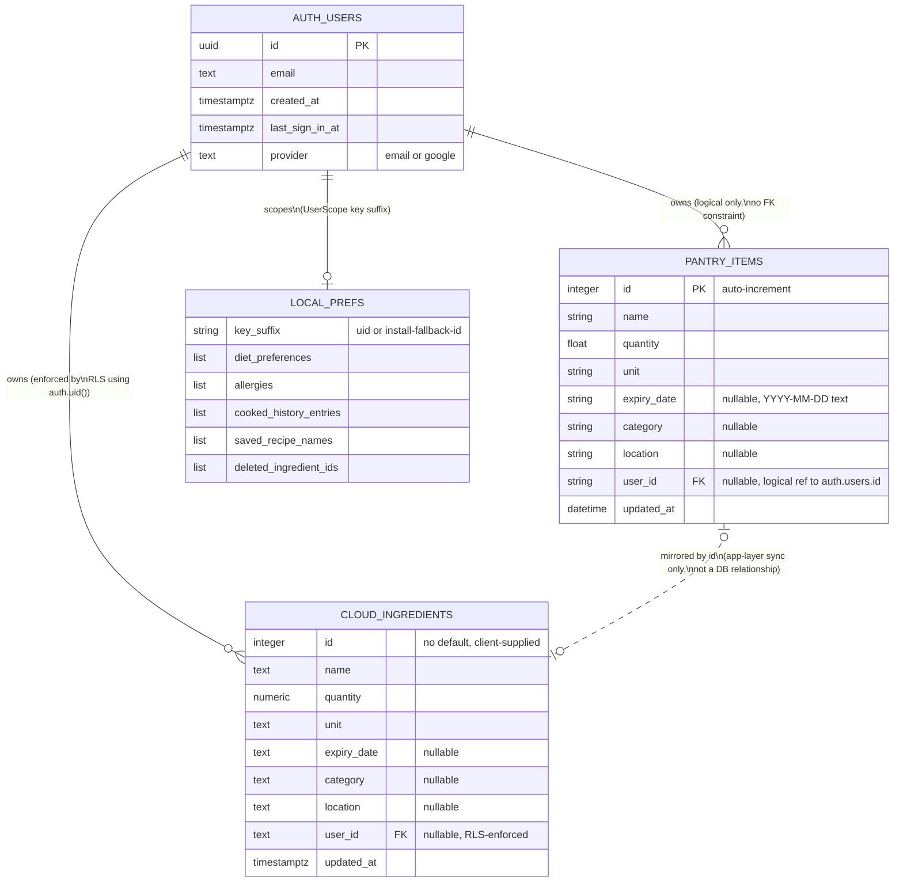

# Fridge2Table — Database Schema

This app's data lives in **three separate physical stores**, none of which share a foreign-key relationship at the database level — they're reconciled entirely at the application layer. Read `docs/ARCHITECTURE.md` §1 first if you haven't; this doc goes deeper on exact columns/constraints.

1. The FastAPI backend's own database (`pantry_items` table) — SQLite locally, Postgres (via Supabase) in production.
2. Supabase's separate `public.ingredients` table — the cloud-sync mirror, written to directly by the Flutter app via the Supabase SDK, never touched by the FastAPI backend.
3. The Flutter app's local device storage (`SharedPreferences` + `flutter_secure_storage`) — not a relational database at all, just key-value pairs.

---

## 1. Backend Database — `pantry_items` table

Defined in `backend/app/models.py`. Engine selection (`backend/app/database.py`): Postgres if the `DATABASE_URL` environment variable is set (production, pointed at Supabase's Session Pooler connection string), otherwise a local SQLite file (`backend/fridge2table.db`, dev only — does not exist/get created in production, since `DATABASE_URL` is always set on Render). The table name and column definitions are **identical** regardless of which physical database engine is behind them — SQLAlchemy's `Base.metadata.create_all()` runs the same schema either way.

**History note:** this table was originally named `ingredients` and was renamed to `pantry_items` (commit `04f13a0`) specifically because that name collided with Supabase's own separately-evolved `public.ingredients` table (§2 below) once the backend started connecting to the same Supabase Postgres instance in production. A direct SQLAlchemy connection carries no Supabase-issued session, so `public.ingredients`'s Row-Level Security policy silently emptied every read (`auth.uid()` evaluates to `NULL` on that connection) and rejected every write. Renaming to a distinct table sidesteps the conflict entirely rather than trying to reconcile two independently-evolved schemas. **The root `README.md` has not been updated and still describes this table under its old name** — treat this doc as the accurate source.

| Column | Type | Constraints | Purpose |
|---|---|---|---|
| `id` | `Integer` | PRIMARY KEY, auto-increment (database-generated) | Row identity. This is the value mirrored to Supabase's `ingredients.id` during sync — see §2. |
| `name` | `String` | NOT NULL | Ingredient name as entered/detected, e.g. "Milk", "Apple". |
| `quantity` | `Float` | NOT NULL | Current amount in stock, in `unit`'s terms. |
| `unit` | `String` | NOT NULL | e.g. `pcs`, `g`, `kg`, `ml`, `L`, `cups`, `tbsp`, `tsp`. |
| `expiry_date` | `String` | Nullable | Stored as plain `YYYY-MM-DD` text, not a native `DATE` type. |
| `category` | `String` | Nullable | e.g. "Vegetables", "Meat & Seafood", "Dairy", "Fruits", "Grains & Bread". |
| `location` | `String` | Nullable | e.g. "Fridge", "Freezer", "Pantry", "Counter". |
| `user_id` | `String` | Nullable, indexed | The Supabase auth user's UUID, as text. Nullable **only** because rows created before per-user scoping existed have no owner — see below. |
| `updated_at` | `DateTime` (timezone-aware) | NOT NULL, default + `onupdate` = current UTC time | Used exclusively for cloud-sync conflict resolution (last-write-wins) — the backend itself never reads this for anything else. |

**No foreign keys are declared.** `user_id` is a *logical* reference to Supabase's `auth.users.id` (§4) — enforced only by application code (every query filters by an exact `user_id` match), not by the database schema, since `auth.users` lives in a different context than this table's own connection is scoped to.

**Orphaned rows:** `backend/scripts/migrate_add_user_id.py` added the `user_id` column to a table that pre-dated per-user scoping. Rows that existed before that migration have `user_id = NULL` and are permanently invisible to every user (every query does `WHERE user_id = <the requesting user's exact id>`, which `NULL` never satisfies) — by design, not a bug, since there's no reliable way to know which account those rows originally belonged to.

## 2. Supabase Postgres — `public.ingredients` table (cloud-sync mirror)

Defined by `supabase_schema.sql` (repo root) plus a mid-project migration applied directly in Supabase's SQL Editor (not tracked as a versioned migration file — the schema below reflects the table's actual current live state, confirmed via a direct `information_schema.columns`/`pg_constraint` query during development, not just the original `.sql` file, since that file only shows the *history* of changes applied, not a single current-state DDL).

This table is **only ever accessed by the Flutter app directly**, via the Supabase client SDK (`SupabaseService`), using the signed-in user's JWT. The FastAPI backend has no connection to this table at all.

| Column | Type | Constraints | Purpose |
|---|---|---|---|
| `id` | `integer` | NOT NULL, **no default** | Always supplied explicitly by the client — mirrors the corresponding `pantry_items.id` from whichever local backend that ingredient came from. This table was never given its own auto-increment identity, since its original design (Phase 10) assumed the client would always supply it. |
| `name` | `text` | | |
| `quantity` | `numeric` | | |
| `unit` | `text` | | |
| `expiry_date` | `text` | Nullable | |
| `category` | `text` | Nullable | |
| `location` | `text` | Nullable | |
| `user_id` | `text` | Nullable | Added by the migration in `supabase_schema.sql`. Rows synced before that migration (Phase 10 test data) have `user_id = NULL` and are permanently inaccessible under the RLS policy below — same orphaning concept as §1, applied independently on the cloud side. |
| `updated_at` | `timestamptz` | Default `now()` | Sync conflict resolution (compared against the corresponding `pantry_items.updated_at`). |

**Constraint:** `UNIQUE (id, user_id)`, functioning as this table's primary key in practice (added mid-project, replacing an original single-column `PRIMARY KEY (id)` — see the "Cloud Sync RLS Bugs" note below for why). This is what lets two different accounts each have their own row at the same `id` without colliding.

**Row-Level Security policy** — `"Users can only access their own ingredients"`:
```
for all to authenticated
using (auth.uid()::text = user_id)
with check (auth.uid()::text = user_id)
```
Enforced by Postgres itself against the caller's verified JWT — a row is only ever readable/writable by the account whose `id` matches its own `user_id`. This is why the FastAPI backend (a direct, non-Supabase-authenticated connection) can never touch this table: `auth.uid()` is `NULL` for that connection, and `NULL = anything` is never true in SQL, so every row is invisible and every write is rejected.

**Cloud Sync RLS bugs, chronologically (all fixed, see `docs/PROJECT_OVERVIEW.md` §4 for commit references):**
1. The table-name collision with the backend's own table (fixed by renaming the backend's table — §1).
2. Orphaned `user_id IS NULL` rows colliding by `id` alone with a newly-syncing real user under the original single-column primary key — fixed by replacing it with the `(id, user_id)` composite uniqueness.
3. That fix then caused new-row insert failures, because removing the old primary key without an explicit replacement left PostgREST with no default upsert-conflict target for any request that didn't specify one — fixed by making `(id, user_id)` an actual constraint that every `.upsert()` call in `supabase_service.dart` now references explicitly via `onConflict: "id,user_id"`.

## 3. Supabase Auth — `auth.users` table

Fully managed by Supabase itself — not defined anywhere in this project's own schema files, and not directly queryable by the app beyond `auth.currentUser`. Documented here only because every `user_id` column above logically points into it.

Relevant fields (standard Supabase Auth schema): `id` (UUID, the value used as `user_id` everywhere else), `email`, `created_at`, `last_sign_in_at`, `app_metadata.provider` (`"email"` or `"google"`), `user_metadata.name` (set at sign-up).

## 4. Frontend Local Storage (Not Relational)

Two different local storage mechanisms, chosen deliberately per sensitivity (see `secure_storage_service.dart`'s own top-of-file comment).

### `flutter_secure_storage` — for genuinely sensitive data

| Key | Written by | Contains |
|---|---|---|
| `auth_name` | `AuthService.cacheIdentity()` | Cached display name |
| `auth_email` | `AuthService.cacheIdentity()` | Cached email (lowercased) |
| `auth_created_at` | `AuthService.cacheIdentity()` | ISO8601 timestamp, set once, never overwritten after first write |
| `sb_session` | `SecureSupabaseLocalStorage` (Supabase SDK's own persistence hook) | The live Supabase session — access token + refresh token pair. Whoever holds this can act as the signed-in user. |
| *(dynamic, SDK-assigned)* | `SecureSupabasePkceStorage` (Supabase SDK's own persistence hook) | The PKCE code verifier, held only transiently mid-OAuth-flow between launching the browser and the deep-link redirect completing. Key names are assigned internally by the Supabase SDK, not literal constants in this app's own code. |

None of these keys are scoped by `UserScope` — there is only ever one signed-in identity's worth of this data on a device at a time, and it's explicitly cleared (`AuthService.clearSession()`, `sb_session` cleared via Supabase's own `signOut()`) on logout.

### `SharedPreferences` — for everything else (not sensitive)

All of the following are namespaced by `UserScope.key(baseKey)`, which produces `"<baseKey>_<uid>"`, where `<uid>` is the signed-in Supabase user's UUID, or — if nobody is signed in / Supabase isn't configured — a random id generated once per app install and persisted under the one *unscoped* key below. This is deliberate: a shared literal fallback like `"guest"` would let two different signed-out sessions collide and see each other's data; a per-install random id can only ever collide with itself.

| Base key (before the `_<uid>` suffix) | Written by | Contains | Scoped? |
|---|---|---|---|
| `user_scope_install_fallback_id` | `UserScope._fallbackId` | The random per-install fallback id itself | **Not scoped** — this is the one global key everything else's scoping depends on |
| `auth_diet_preferences` | `AuthService.saveDietPreferences()` | List of selected diet preference names (e.g. `["Vegetarian", "Gluten-Free"]`) | Per-user |
| `auth_allergies` | `AuthService.saveAllergies()` | List of selected allergy names (e.g. `["Milk", "Peanuts"]`) | Per-user |
| `cooked_history_entries` | `CookedHistoryStore._persist()` | JSON-encoded list of `CookedHistoryEntry` (name, time, calories, timesCooked, lastCookedLabel, deductionSummary, ingredientNames) | Per-user |
| `saved_recipe_names` | `SavedRecipesStore.toggle()` | Set of bookmarked recipe names | Per-user |
| `deleted_ingredient_ids` | `DeleteTombstones.add()` / `.remove()` | Set of ingredient ids deleted locally whose cloud mirror-delete isn't yet confirmed | Per-user |

## 5. Entity-Relationship Diagram



Note on the diagram: `PANTRY_ITEMS` and `CLOUD_INGREDIENTS` are connected by a dashed line because there is genuinely no database-level relationship between them — they live in different logical namespaces of the same physical Postgres instance in production, and the only thing connecting a row in one to a row in the other is that the Flutter app's sync code happens to reuse the same `id` value when it pushes/pulls. `LOCAL_PREFS` isn't a real table at all — it represents the `SharedPreferences` key-value store, shown here only to make the per-user scoping relationship visible.
