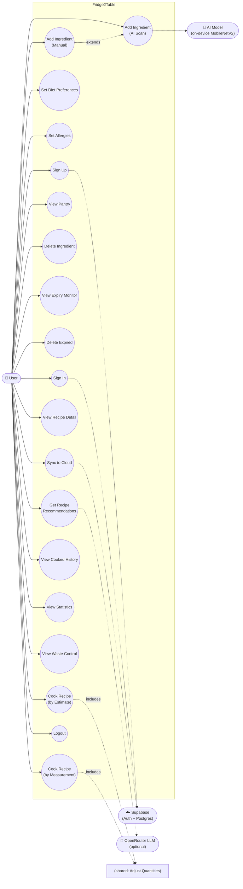

# Fridge2Table — Use Case Documentation

Every use case below was verified against the actual current implementation (file paths given per use case). Where the app's real behavior differs from what might be assumed, that's called out explicitly rather than smoothed over.

---

## Use Case Diagram

Mermaid has no native UML use-case oval notation, so this is represented as a flowchart: actors on the outside, use cases as rounded nodes inside the system boundary.

---

## UC1 — Sign Up

**Actor(s):** User (primary), Supabase Auth (secondary)
**Preconditions:** User does not have an account, or is signed out. `SupabaseConfig.isConfigured` is true.
**Main flow:**
1. User opens the app for the first time (or taps "Create one" from Sign In) and reaches `CreateAccountScreen`.
2. User enters full name, email, password (min. 8 characters), confirms password, and checks "I agree to the Terms of Service and Privacy Policy".
3. User taps "Create Account".
4. App calls `Supabase.instance.client.auth.signUp()` with the email/password and name metadata.
5. If Supabase returns an active session immediately (email confirmation not required): app caches identity locally (`AuthService.cacheIdentity()`), pulls down any existing cloud data (`SupabaseService.resolveConflicts()`), and navigates to `DietPreferencesScreen`.
6. If Supabase requires email confirmation (`response.session == null`): app shows a blocking "Check your email" dialog and returns the user to Sign In.

**Alternate/exception flows:**
- Name or email left empty → inline error, no request sent.
- Password under 8 characters, or the two password fields don't match → inline error, no request sent.
- "I agree..." not checked → the Create Account button is disabled entirely.
- Supabase rejects the sign-up (e.g. email already registered) → `AuthException.message` shown in a SnackBar.
- Alternative path: **Sign Up with Google** — same screen has a "Sign up with Google" button; see UC2's Google flow, which handles both sign-up and sign-in through the same OAuth path (Supabase finds-or-creates the account server-side).

**Postconditions:** A new `auth.users` row exists in Supabase. If email confirmation wasn't required, the user lands on `DietPreferencesScreen` to complete onboarding. If confirmation was required, no session exists yet — the user must confirm via email and then sign in (UC2).

---

## UC2 — Sign In

**Actor(s):** User (primary), Supabase Auth (secondary)
**Preconditions:** User has a confirmed account, or is signing in via Google. `SupabaseConfig.isConfigured` is true.
**Main flow (email/password):**
1. User opens `SignInScreen`, enters email and password, taps "Sign In".
2. App calls `signInWithPassword()`.
3. On success: caches identity, calls `resolveConflicts()` to pull cloud data, navigates to `MainScreen`.

**Main flow (Google OAuth):**
1. User taps "Continue with Google".
2. App calls `signInWithOAuth(Google, LaunchMode.inAppWebView)`, which opens Google's account picker in an in-app WebView.
3. Google redirects back via the app's deep link (`fridge2table://login-callback/`).
4. `main.dart`'s root `onAuthStateChange` listener catches the resulting `signedIn` event (this happens outside the screen that triggered it, since the redirect can land arbitrarily later).
5. App distinguishes new vs. returning account by comparing `createdAt`/`lastSignInAt` (within 10 seconds of each other = brand new), and shows a confirmation dialog ("New account — create one and continue?" or "Welcome back — continue as X?").
6. On confirmation: caches identity, resolves conflicts, navigates to `MainScreen` (clearing the back stack).

**Alternate/exception flows:**
- Wrong password / unknown email → "Incorrect email or password" SnackBar.
- Email not yet confirmed → "Please confirm your email first — check your inbox".
- User declines the OAuth confirmation dialog → app signs back out immediately, no navigation.
- Any other `AuthException` during either flow → its message is shown directly.
- A previously-persisted session already exists at app launch → the user skips Sign In entirely; `main.dart` routes straight to `MainScreen` on cold start.

**Postconditions:** A valid Supabase session exists on-device (persisted in `flutter_secure_storage`). The user is on `MainScreen`. Cloud data has been pulled down via `resolveConflicts()`.

---

## UC3 — Set Diet Preferences

**Actor(s):** User
**Preconditions:** User is either completing onboarding (right after UC1) or has navigated to Profile → "Edit" on the Diet Preferences card.
**Main flow:**
1. `DietPreferencesScreen` opens on the diet-preferences step and **loads any previously-saved selections** (fixed in the most recent development session — this screen previously always opened blank regardless of what was already saved).
2. User taps one or more diet cards (Vegetarian, Vegan, Pescatarian, Halal, Kosher, Gluten-Free, Dairy-Free, Keto, Low Sugar, or "No Restrictions", or "Other" with free text).
3. Selecting "No Restrictions" clears every other selection (they're mutually exclusive with everything else); selecting anything else clears "No Restrictions" if it was set.
4. User taps "Continue" to proceed to the allergy step (UC4), or "Skip for now" to save whatever's selected so far and finish immediately.

**Alternate/exception flows:**
- User selects "Other" and leaves the text field empty → the literal string `"Other"` is saved.
- User navigates back mid-flow (chevron on the allergy step) → returns to the diet step without losing selections made so far (in-memory state, not yet persisted).

**Postconditions:** `AuthService.saveDietPreferences()` persists the selected list to `SharedPreferences`, scoped to the current user. Recipe Detail's diet-conflict banner and the Cook Now blocking dialog will reflect this immediately on next view.

---

## UC4 — Set Allergies

**Actor(s):** User
**Preconditions:** Same as UC3 — reached either as onboarding's second step or via Profile → Edit.
**Main flow:**
1. Allergy step shows a fixed list (Milk, Eggs, Soy, Wheat, Fish, Sesame, Mustard, Peanuts, Tree Nuts, Shellfish, or "No Allergies", or "Other"), each tagged with a severity (Common/Moderate/Severe, from `data/allergy_severities.dart`).
2. A persistent warning banner reminds the user this app's warnings don't replace reading ingredient labels.
3. User selects one or more allergies (or "No Allergies", mutually exclusive with the rest, same pattern as diet preferences).
4. User taps "All done — Let's go!".

**Alternate/exception flows:** Same "Other" free-text and back-navigation behavior as UC3.

**Postconditions:** `AuthService.saveAllergies()` persists the list. User is navigated to `MainScreen`. Recipe Detail's allergy-conflict banner and the Cook Now blocking dialog reflect this immediately.

---

## UC5 — Add Ingredient (Manual)

**Actor(s):** User
**Preconditions:** User is signed in.
**Main flow:**
1. From Home ("Add Item" quick action) or Pantry ("+" floating button), user opens `AddIngredientScreen` with an empty form.
2. User enters name (required), quantity, unit, category, storage location, and optionally taps the expiry field to pick a date (`showDatePicker`, cannot be before today).
3. User taps "Save Ingredient".
4. App calls `POST /ingredient`.
5. If the saved category is "Vegetables" or "Fruits", a bottom sheet offers to show Waste Control tips for using the scraps.
6. Screen pops back to whichever list triggered it, which refreshes.

**Alternate/exception flows:**
- Name left empty → SnackBar "Please enter an ingredient name", save blocked.
- Backend unreachable/times out/returns non-200 → SnackBar with the specific error message from `ApiService`'s error translation (timeout vs. connection-refused vs. server error).

**Postconditions:** A new row exists in the backend's `pantry_items` table (or, if editing, an existing row is updated via `PUT /ingredient/{id}`). Not yet reflected in the cloud-sync table until the next sync.

---

## UC6 — Add Ingredient (AI Scan)

**Actor(s):** User (primary), AI Model (secondary, on-device)
**Preconditions:** User is signed in. Device has a working camera (or the user uses the gallery-picker fallback).
**Main flow:**
1. User taps the floating scan button (any tab) or "AI Scan" quick action, opening `AiCameraScreen`.
2. User points the camera and taps the capture button (or picks an existing photo from the gallery).
3. App navigates to `AiDetectionScreen`, which lazily initializes `IngredientClassifierService` (loads the bundled TFLite model + class names on first use) and runs `classify(imagePath, topK: 3)` entirely on-device.
4. The top 3 candidates are shown as tappable chips with confidence percentages; the highest-confidence one is pre-selected.
5. User taps the correct chip (or "None of these — enter manually").
6. App navigates to `AddIngredientScreen` with the name field pre-filled from the chosen label (badged "AI detected") and the captured photo shown at the top of the form.
7. From here, flow continues exactly as UC5 from step 2.

**Alternate/exception flows:**
- No camera available on the device → error message shown in place of the camera preview; user can still use the gallery-pick button.
- Classification throws (corrupt image, model load failure) → "Couldn't identify this photo: ..." shown, user can rescan.
- User picks "None of these — enter manually" → skips straight to a blank `AddIngredientScreen` (no photo carried over in this specific path, since `capturedImagePath` isn't passed when going this route from `AiDetectionScreen._goToAddIngredient()` with no `prefilledName`).

**Postconditions:** Same as UC5 — no photo or classification data is ever sent anywhere; only the final ingredient the user confirms is saved to the backend.

---

## UC7 — View Pantry

**Actor(s):** User
**Preconditions:** User is signed in.
**Main flow:**
1. User opens the "Pantry" tab (`InventoryScreen`).
2. App calls `GET /inventory`, showing every ingredient as a card: initials avatar (category-colored), name, quantity/unit/category line, and — if relevant — a colored urgency badge (red "Expired", orange "Today", yellow "Soon"; nothing shown for fresh/unknown items).
3. User can filter by category chip (All/Vegetables/Protein/Dairy/Fruits/Grains) or type in the search bar (matches by name, case-insensitive).
4. Pull-to-refresh re-fetches.

**Alternate/exception flows:**
- Pantry is empty → "Your pantry is empty — tap + to add ingredients".
- Search/filter yields nothing → "No ingredients match your search".
- Load fails → retry button (`AsyncStateBuilder`'s error state) with the specific connection error.

**Postconditions:** None (read-only view). Tapping a card's edit icon opens `AddIngredientScreen` in edit mode (UC5's flow, pre-filled); tapping delete triggers UC8.

---

## UC8 — Delete Ingredient

**Actor(s):** User
**Preconditions:** User is viewing the Pantry or Expiry Monitor screen and the target ingredient has a database id.
**Main flow:**
1. User taps the trash icon on an ingredient card.
2. App shows a confirmation dialog: "Remove [name] from pantry?" with Cancel / Remove.
3. User taps "Remove".
4. App calls `DELETE /ingredient/{id}`, then records a delete tombstone and best-effort mirrors the delete to the cloud-sync table.
5. List refreshes, item is gone.

**Alternate/exception flows:**
- User taps Cancel → dialog closes, nothing happens.
- Cloud mirror-delete fails (e.g. offline) → the local delete still succeeds; the tombstone ensures the next sync completes the cloud-side delete instead of resurrecting the item.

**Postconditions:** Row removed from `pantry_items`. Eventually (next sync) also removed from the cloud-sync table.

---

## UC9 — View Expiry Monitor

**Actor(s):** User
**Preconditions:** User is signed in.
**Main flow:**
1. User opens Expiry Monitor (from Home's expiry alert card, or Pantry's calendar icon).
2. App calls `GET /expiry-status`, which classifies every ingredient server-side as `expired`/`today`/`soon`/`fresh`/`unknown` based on `expiry_date` vs. the server's current date.
3. Items render grouped by status, most urgent first; each group only shows if non-empty.
4. Tapping a **non-expired** item shows a bottom sheet offering recipe recommendations for it (routes into `RecipeScreen`, pre-filtered).
5. Tapping an **expired** item shows a different bottom sheet ("This is expired — not safe to cook with. But you can still use it:") that routes into Waste Control instead, targeted at the most relevant tab/search term for that ingredient (e.g. "milk" → Scrap Recipes tab, pre-searched).

**Alternate/exception flows:**
- Nothing tracked yet → empty state with a checkmark icon.
- Load fails → retry.

**Postconditions:** None (read-only, aside from the delete actions covered in UC8/UC10).

---

## UC10 — Delete Expired

**Actor(s):** User
**Preconditions:** At least one item in the "Expired" group on Expiry Monitor.
**Main flow:**
1. User taps "Delete All Expired" next to the Expired group header.
2. Confirmation dialog: "Delete all expired items? This will remove all N expired item(s) from your pantry. This can't be undone." — Cancel / Delete.
3. User confirms.
4. App calls `DELETE /ingredient/{id}` once per expired item (each also going through the same tombstone/cloud-mirror handling as UC8).
5. List refreshes.

**Alternate/exception flows:** User cancels → no action.

**Postconditions:** Every previously-expired row is removed from `pantry_items` (and, eventually, the cloud-sync table).

---

## UC11 — Get Recipe Recommendations

**Actor(s):** User (primary), OpenRouter LLM (secondary, optional)
**Preconditions:** User is signed in.
**Main flow:**
1. User opens the "Recipes" tab.
2. App calls `GET /recipes`, which matches **every** pantry item (regardless of expiry status) against the 302-recipe dataset by normalized shared ingredients, filtered to a minimum match score and shared-ingredient count (relaxed for pantries under 5 items), sorted by match score descending, capped at 25.
3. Separately, an "AI Pick for You" banner calls `GET /ai-recommendation`, which — if the backend has an `OPENROUTER_API_KEY` configured — asks an LLM to choose the single best recipe from the top candidates; otherwise it deterministically falls back to the top match.
4. User can filter (AI Picks/Quick/Healthy/Saved/Cooked) or search by name/ingredient.
5. Each recipe card shows its match percentage, and — if applicable — a small warning icon: red ⚠️ if any matched ingredient is expired, orange/amber ⏰ if any is expiring today/soon (expired takes visual priority if both apply).

**Alternate/exception flows:**
- Pantry is empty → "Add ingredients to your pantry to discover recipes".
- No recipes clear the match threshold → "No recipes found" (with a tip if the best match is under 50%: "Add more ingredients to your pantry for better recipe matches").
- OpenRouter call fails or times out, or no API key is set → silently falls back to the top deterministic match; the AI banner still shows a result either way.

**Postconditions:** None (read-only). Tapping a card leads to UC12.

---

## UC12 — View Recipe Detail

**Actor(s):** User
**Preconditions:** A recipe has been selected from anywhere that produces a `RecipeDetail` (Recipe list, AI banner, Cooked History's "Cook Again", Expiry Monitor's rescue sheet).
**Main flow:**
1. `RecipeDetailScreen` shows the recipe's hero image placeholder, tags, prep/cook time, calories, difficulty, and match percentage.
2. If the recipe uses any expired matched ingredient: a red banner ("⚠️ This recipe uses expired ingredients — check freshness before cooking"). Else if it uses any expiring-soon ingredient: an amber banner ("⏰ Use this recipe to rescue expiring ingredients!").
3. If the user's allergies match an ingredient: a red "ALLERGY WARNING" card. If the user's diet preferences conflict: an amber "DIET CONFLICT" card (checked against all 9 diet types — Vegetarian/Vegan/Pescatarian/Halal/Kosher/Gluten-Free/Dairy-Free/Keto/Low Sugar).
4. Sustainability tip, full ingredient list (with a "Missing" badge for anything not in the pantry), nutrition breakdown.
5. User can tap "Save Recipe" (bookmark toggle) or "Cook Now".

**Alternate/exception flows:** None specific to viewing — see UC13/UC14 for what happens on Cook Now, including the blocking conflict dialog.

**Postconditions:** None from viewing alone; bookmarking persists to `SavedRecipesStore`.

---

## UC13 — Cook Recipe (by Estimate)

**Actor(s):** User
**Preconditions:** Viewing `RecipeDetailScreen`.
**Main flow:**
1. User taps "Cook Now". If there's an allergy/diet conflict, a blocking dialog ("Heads up" — Cancel / Continue Anyway) must be resolved first (see UC14 for the shared mechanics).
2. `CookingModeScreen` walks through the recipe's steps one at a time (Prev/Next, progress bar).
3. On the last step, "Finish Cooking" leads to `CookingConfirmScreen`, where the user selects **"By estimate"** ("I cooked by feel — rough handfuls, pinches, and splashes").
4. This leads to the same `AdjustQuantitiesScreen` used by UC14, with `byEstimate: true` — which changes only the header copy and shows by-feel hints (e.g. "salt: always by feel, not measurement") for ingredients commonly used approximately, alongside the same editable-amount + skip-toggle UI as the measurement path.
5. User adjusts or skips ingredients, taps "Confirm & Update Pantry".
6. `RecipeCookingService.deduct()` runs (see UC14, step 5 onward — mechanically identical from here).

**Alternate/exception flows:** Same validation/error handling as UC14.

**Postconditions:** Same as UC14. **Note:** as of the current implementation, "by estimate" and "by measurement" are the same underlying flow with only cosmetic differences (hint text) — there is no longer a functionally distinct "skip everything, deduct nothing precisely" path; both let the user see and adjust exact quantities.

---

## UC14 — Cook Recipe (by Measurement)

**Actor(s):** User
**Preconditions:** Viewing `RecipeDetailScreen`.
**Main flow:**
1. User taps "Cook Now".
2. If `_matchedAllergens` or `_matchedDietConflicts` is non-empty: a blocking `AlertDialog` (not a SnackBar) shows — warning icon, "Heads up" title, the specific conflict description, Cancel / Continue Anyway. Cancel aborts; Continue Anyway proceeds.
3. `CookingModeScreen` step-through, same as UC13.
4. On `CookingConfirmScreen`, user selects **"By measurement"** ("I followed the recipe amounts").
5. `AdjustQuantitiesScreen` calls `RecipeCookingService.planUsage()`, showing every matched ingredient with an editable amount field, pre-filled with a unit-aware typical-usage default (e.g. 100g, 2pcs, 0.5 cups — real recipes only list ingredient names, not quantities, so this is an assumption, not data from the recipe itself), plus a per-ingredient skip toggle.
6. Live validation: if a typed amount exceeds what's actually in stock, that row shows a red error ("Only X unit available...") and the Confirm button is disabled until fixed.
7. User taps "Confirm & Update Pantry".
8. `RecipeCookingService.deduct()` runs: for each non-skipped, matched ingredient, subtracts the confirmed amount; if the result is ≤0, deletes the ingredient (UC8's mechanics apply, including the tombstone); otherwise updates its quantity via `PUT`.
9. `RecipeCompleteScreen` shows before/after per ingredient and estimated sustainability stats (food saved, CO₂ avoided, money saved, points).
10. `CookedHistoryStore.recordCook()` persists the cook to local history.

**Alternate/exception flows:**
- User cancels the conflict dialog → returns to Recipe Detail, nothing else happens.
- An ingredient in the recipe isn't in the pantry at all → recorded as a "symbolic" use (shown as "Used" on Recipe Complete), no actual deduction possible.
- Backend calls fail mid-deduction → best-effort; the completion screen still shows the intended change even if a particular update/delete call failed.

**Postconditions:** Pantry quantities updated (and some possibly deleted) in `pantry_items`. A `CookedHistoryEntry` persisted locally, per-user. Statistics/Profile figures (Food Saved, Eco Score, etc.) reflect the new cook on next view.

---

## UC15 — View Cooked History

**Actor(s):** User
**Preconditions:** User is signed in (history is local, per-user, so a fresh account or new device shows none — see `docs/DATA_PERSISTENCE.md`).
**Main flow:**
1. User opens Cooked History (reached via Recipe Complete's "View History" button).
2. `CookedHistoryStore.load()` reads the persisted list for this user.
3. Shows total meals cooked, unique recipes, total calories, then every distinct recipe cooked (times cooked, last-cooked date, last deduction summary).
4. Tapping a card or "Cook Again" opens `RecipeDetailScreen` via `RecipeDetail.forName()` — a minimal reconstruction (name only; full recipe data like ingredients/steps isn't retained in history, so this is a simplified fallback view, not the original full recipe).

**Alternate/exception flows:** No history yet → "No cooked recipes yet".

**Postconditions:** None (read-only).

---

## UC16 — View Statistics

**Actor(s):** User
**Preconditions:** User is signed in.
**Main flow:**
1. User opens Statistics (from Profile's "Statistics" row).
2. "Your Pantry Right Now" (2×2 grid, all from live backend calls run concurrently): Items in Pantry, Expiring Soon (today+soon), Expired (strictly past-date), Recipes Matched.
3. "Cooking Impact": Food Saved (kg, estimated from `CookedHistoryStore`), Recipes Cooked.
4. A 6-month trend bar chart (saved vs. wasted estimate) and a "Most Used Categories" donut chart, both derived from cooked-history data.

**Alternate/exception flows:** Any individual stat call failing shows "—" for that figure only, not a whole-screen error (each of the four backend calls has its own independent try/catch).

**Postconditions:** None (read-only).

---

## UC17 — View Waste Control

**Actor(s):** User
**Preconditions:** None beyond being signed in.
**Main flow:**
1. User opens Waste Control (Profile row, Home quick action, or a routed link from an expired-item tap in Expiry Monitor).
2. Four tabs: Regrow (17 entries — e.g. regrowing spring onion, garlic, potato eyes from scraps), Scrap Recipes (17 entries — e.g. vegetable stock, banana peel "bacon"), Compost (10 entries + a composting-methods comparison: backyard bin/Bokashi/vermicomposting/community drop-off), Storage Tips (8 entries — e.g. the paper-towel trick for leafy greens, why tomatoes shouldn't be refrigerated).
3. A search bar filters within whichever tab is active.
4. Tapping any entry opens a detail bottom sheet with steps, time estimate, and difficulty.

**Alternate/exception flows:** Search yields nothing → "No results for '...'".

**Postconditions:** None (informational only).

---

## UC18 — Sync to Cloud

**Actor(s):** User (primary), Supabase (secondary)
**Preconditions:** User is signed in and `SupabaseConfig.isConfigured`.
**Main flow:**
1. Automatic: every time `MainScreen` is created (app launch, or right after sign-in), `SupabaseService.resolveConflicts()` runs silently in the background — no UI feedback, failures are simply ignored.
2. Manual: user opens Cloud Sync (Profile row) and taps "Sync Now".
3. `resolveConflicts()` runs the full two-way merge described in `docs/ARCHITECTURE.md` §6 (per-id comparison by `updated_at`, tombstone-aware).
4. Result message shown in a SnackBar (e.g. "Resolved sync — 3 changes applied").

**Alternate/exception flows:**
- Not signed in / not configured → "You must be signed in to sync" / "Cloud sync isn't configured yet".
- Network failure mid-sync → `SyncResult.failure()` with the exception message; partial changes already applied before the failure are not rolled back (each row's sync step is independent).

**Postconditions:** Local (`pantry_items`) and cloud (`ingredients`) tables converge to the same state for this user, resolved by most-recently-updated per row. **Note:** the Cloud Sync screen's WiFi/Mobile Data/Background Sync toggles do not actually affect when this runs — they are UI-only placeholders (see `docs/PROJECT_OVERVIEW.md` §6).

---

## UC19 — Logout

**Actor(s):** User
**Preconditions:** User is signed in.
**Main flow:**
1. User opens Profile, taps "Log Out".
2. Confirmation dialog: "Log out? You'll need to sign in again to access your pantry." — Cancel / Log Out.
3. On confirm: `Supabase.instance.client.auth.signOut()` (best-effort — proceeds even if this network call fails, e.g. offline), then `AuthService.clearSession()` (clears cached name/email/created-at from secure storage), then `CookedHistoryStore.reset()` and `SavedRecipesStore.reset()` (clear in-memory caches so a different account signing in next doesn't see stale cached data).
4. Navigates to `SignInScreen`, clearing the entire back stack.

**Alternate/exception flows:** User cancels → dialog closes, no action.

**Postconditions:** No active Supabase session. Diet preferences, allergies, cooked history, and saved recipes are **not deleted** — they remain on disk under this user's scoped keys and will be picked back up automatically if the same account signs in again on this device (see `docs/DATA_PERSISTENCE.md`).
